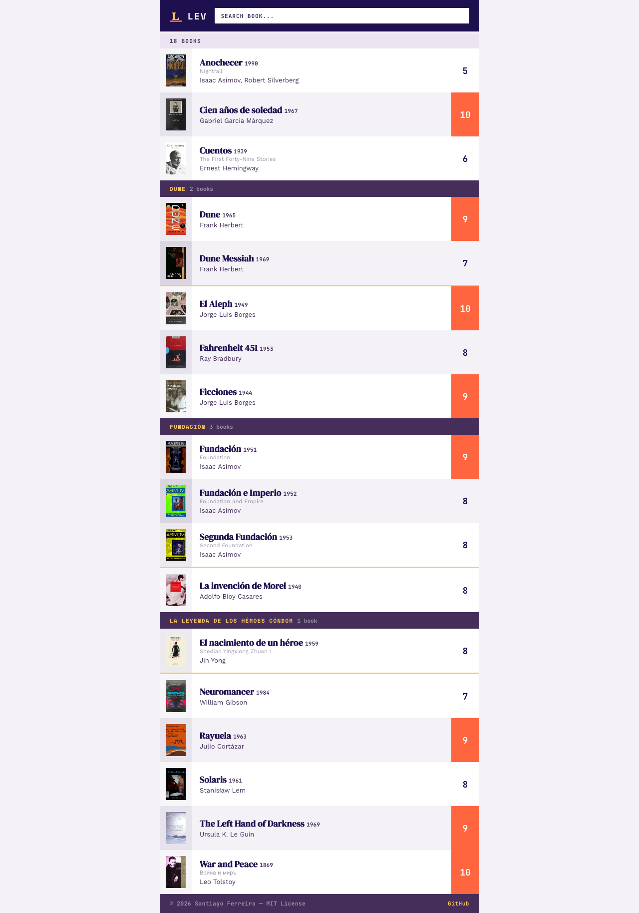

<p align="center">
  
</p>

<h1 align="center">Lev</h1>

<p align="center">
  <strong>A brutalist personal book tracker that gets out of your way.</strong><br>
  Named after Lev Tolstoy. Built with zero frameworks. Deployed on GitHub Pages.
</p>

<p align="center">
  <a href="https://books.42.uy">books.42.uy</a>
</p>

---

Lev is a fast, opinionated, single-page book tracker. Track your reading with scores, reviews, saga grouping, cover art, and fuzzy search. Manage your library from the command line with Ruby scripts and auto-commit every change.

## Screenshots



## Features

- **Zero dependencies** — no build step, no node_modules, no bundler. Just files.
- **Brutalist design** — five colors, four fonts, no borders, no rounded corners, no shadows.
- **Saga grouping** — books in a series are grouped under a colored header, sorted by reading order.
- **Fuzzy search** — trigram-based matching across titles, authors, original titles, and saga names.
- **Keyboard-driven** — arrow keys to navigate, Enter to open, F to search, ? for help.
- **Book covers** — downloaded and served locally. Placeholder gradients with title initials when missing.
- **Personal scores & reviews** — rate books 1-10 and write reviews rendered in serif type.
- **PWA support** — installable as an app with offline caching via service worker.
- **CLI tooling** — Ruby scripts to add books, edit metadata, and write reviews from your terminal.
- **Auto-commit** — every change made through the CLI is committed to git automatically.

## Development

### Prerequisites

- **Python 3** — for the local dev server
- **Ruby** — for the CLI data management scripts
- **Make** — for running commands (included on macOS and Linux)

### Getting started

```bash
git clone https://github.com/san650/books.42.uy.git
cd books.42.uy
make server
```

Open [http://localhost:8000](http://localhost:8000) in your browser.

### Commands

| Command | Description |
|---------|-------------|
| `make server` | Start a local dev server on port 8000 |
| `make add` | Add a new book — searches Goodreads, scrapes metadata, downloads cover |
| `make edit` | Edit an existing book — refetch metadata, update fields |
| `make review` | Write or edit a review — opens your `$EDITOR` |
| `make format` | Run the pre-commit formatter on `db.json` |

### Project structure

```
docs/               # Static site served by GitHub Pages
  index.html        # Single-page app (HTML + CSS + JS, all inline)
  db.json           # Book database (pretty-printed JSON)
  covers/           # Locally hosted cover images
  assets/           # Self-hosted WOFF2 fonts, logo, PWA icons
  manifest.json     # PWA manifest
  sw.js             # Service worker for offline support
scripts/            # Ruby CLI tools
  add_book.rb       # Add a book by searching Goodreads
  edit_book.rb      # Edit book metadata
  add_review.rb     # Add or edit a review
  common.rb         # Shared utilities
resources/          # Screenshots and documentation assets
```

## Deployment

Lev is deployed as a static site on **GitHub Pages**. No CI/CD pipeline needed — just push to `main`.

### Deploy to GitHub Pages

1. **Fork or clone** this repository.

2. **Go to Settings > Pages** in your GitHub repo.

3. **Set the source** to deploy from the `main` branch, and set the directory to `/docs`.

4. **Custom domain** (optional): add a `CNAME` file inside `docs/` with your domain name, then configure your DNS:
   ```
   # For apex domain (example.com)
   A     @    185.199.108.153
   A     @    185.199.109.153
   A     @    185.199.110.153
   A     @    185.199.111.153

   # For subdomain (books.example.com)
   CNAME books your-username.github.io
   ```

5. **Push to `main`** — GitHub Pages will automatically build and deploy your site within minutes.

That's it. No build step, no artifacts, no deploy scripts.

## Contributing

Contributions are welcome! Here's how to get started:

1. **Fork** the repository and clone your fork locally.

2. **Create a branch** for your feature or fix:
   ```bash
   git checkout -b my-feature
   ```

3. **Make your changes.** A few things to keep in mind:
   - The entire app lives in `docs/index.html` — HTML, CSS, and JS are all inline.
   - CSS uses a three-layer architecture: `reset`, `utility`, `component`. Prefer utility classes.
   - Stick to the five-color palette and four-font system defined in `:root`.
   - No external libraries. No npm. No build tools.
   - Semantic HTML — use `<nav>`, `<dialog>`, `<article>`, `<kbd>`, etc.

4. **Test locally** with `make server` and verify on both desktop and mobile viewports.

5. **Open a pull request** with a clear description of what you changed and why.

### Design principles

- **CSS over JS.** If it can be done with CSS transitions, `:hover`, or `@starting-style` — do it in CSS.
- **No borders, no rounded corners, no shadows.** The brutalist aesthetic is intentional.
- **Mobile-first.** The modal fills the entire viewport on small screens.
- **Keyboard-first.** Every interaction should be reachable without a mouse.

## License

MIT License &copy; 2026 [Santiago Ferreira](https://github.com/san650)

See [LICENSE](LICENSE) for the full text.
